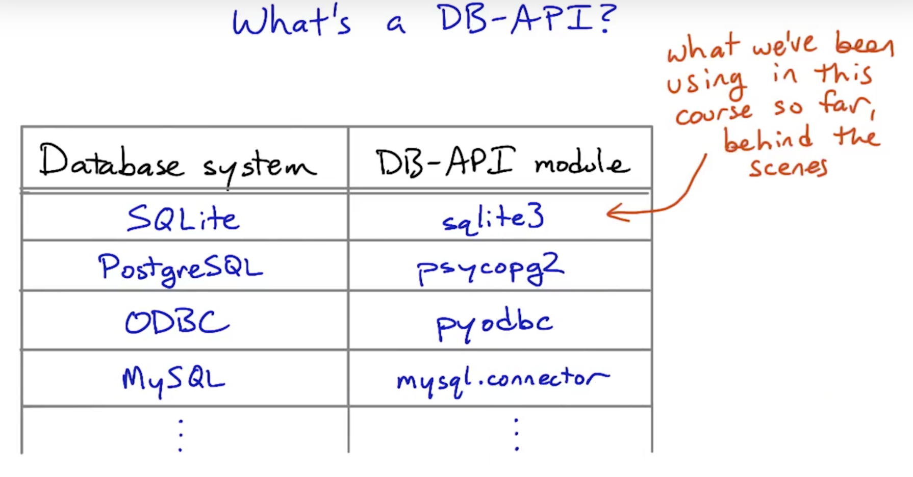
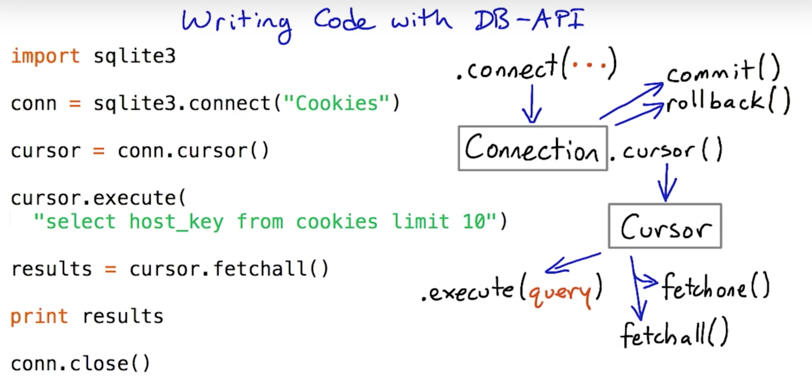
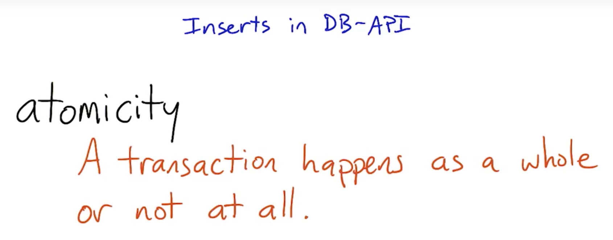
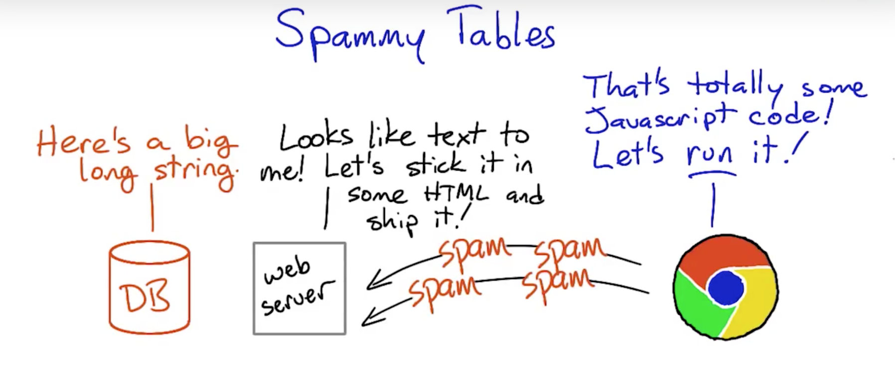

## Python DB-API



For a full reference to the Python DB-API, see [the specification](https://www.python.org/dev/peps/pep-0249/#introduction) and the documentation for specific database modules, such as [sqlite3](https://docs.python.org/2/library/sqlite3.html) and [psycopg2](http://initd.org/psycopg/docs/).



**module.connect(...)**
Connect to a database. The arguments to connect differ from module to module; see the documentation for details. **connect** returns a **Connection** object or raises an exception.

**Connection.cursor()**
Makes a **Cursor** object from a connection. Cursors are used to send SQL statements to the database and fetch results.

**Connection.commit()**
Commits changes made in the current connection. You must call **commit** before closing the connection if you want changes (such as inserts, updates, or deletes) to be saved. Uncommitted changes will be visible from your currect connection, but not from others.

**Connection.rollback()**
Rolls back (undoes) changes made in the current connection. You must roll back if you get an exception if you want to continue using the same connection.

**Connection.close()**
Closes the connection. Connections are always implicitly closed when your program exits, but it's a good idea to close them manually especially if your code might run in a loop.

**Cursor.execute(statement)**
**Cursor.execute(statement, tuple)**
Execute an SQL statement on the database. If you want to substitute variables into the SQL statement, use the second form — see the [documentation](http://initd.org/psycopg/docs/usage.html#query-parameters) for details.

> If your statement doesn't make sense (like if it asks for a column that isn't there), or if it asks the database to do something it can't do (like delete a row of a table that is referenced by other tables' rows) you will get an exception.

**Cursor.fetchall()**
Fetch all the results from the current statement.

**Cursor.fetchone()**
Fetch just one result. Returns a tuple, or None if there are no results.

python select query
```python
import psycopg2

connettion = psycopg2.connect('dbname=forum')
cursor = connettion.cursor()
query = "select * from posts order by id desc;"
cursor.execute(query)
cursor.fetchall()
connettion.close()
```



python insert query
```python
import psycopg2

db = psycopg2.connect('dbname=forum')
c = db.cursor()
insert_query = "insert into posts values (%s)"
text = (content,)
c.execute(insert_query, text)
db.commit()
db.close()
```
```python
import sqlite3

db = sqlite3.connect("testdb")
c = db.cursor()
c.execute("insert into balloons values ('blue', 'water') ")
db.commit()
db.close()
```

### :warning:SQL Injection Attack

Input this code:
```
'); delete from posts; --
```
> **Warning** Never, **never, NEVER** use Python string concatenation (+) or string parameters interpolation (%) to pass variables to a SQL query string. Not even at gunpoint.

solution:
```python
import psycopg2

db = psycopg2.connect('dbname=forum')
c = db.cursor()
insert_query = "insert into posts values (%s)"
text = (content,)
c.execute(insert_query, text)
db.commit()
db.close()
```

### :warning:Script Injection Attack



Input this code:
```javascript
<script>
setTimeout(function() {
    var tt = document.getElementById('content');
    tt.value = "<h2 style='color: #FF6699; font-family: Comic Sans MS'>Spam, spam, spam, spam,<br>Wonderful spam, glorious spam!</h2>";
    tt.form.submit();
}, 2500);
</script>
```

#### Input Sanitization and Output Sanitization

> Clearing out bad data before it ever gets into the database — input sanitization — is one effective approach to preventing attacks like this one.

solution: use [bleach](https://bleach.readthedocs.io/en/latest/) to escape script injection.

## References
[PostgreSQL documentation](https://www.postgresql.org/docs/9.6/app-psql.html)
https://xkcd.com/327/
https://bobby-tables.com

## Python packages
```pip install psycopg2-binary bleach```
